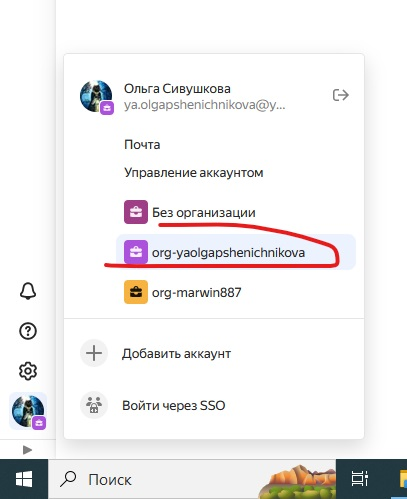
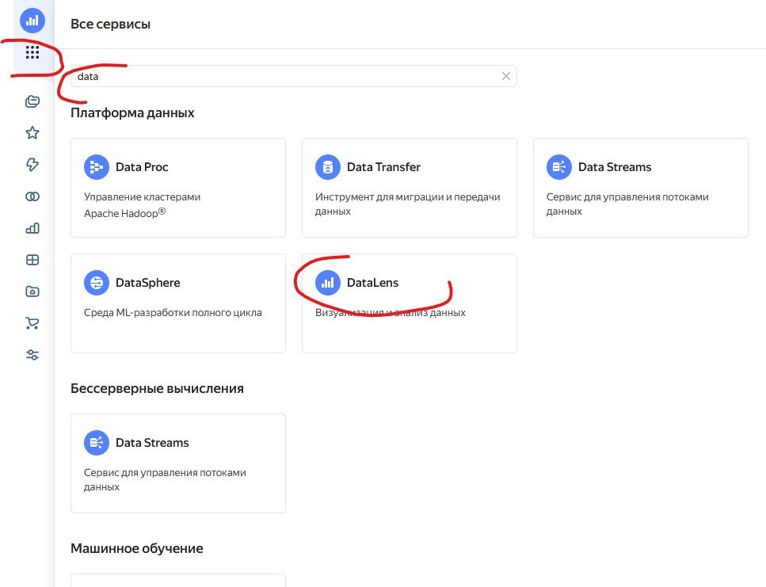

## Yandex DataLense

Yandex DataLense это сервис который мы используем для исследования
геолокационных данных. В нашей группе мы используем централизованную
схему в облачном пространстве Яндекса, далее *Облако*.

## Доступ

Для получения доступа пройдите [процесс социализации](README.md) в нашей
корпорации.

## Подключение

Для подключения к *Линзе* выполните следующую последовательность действий.

